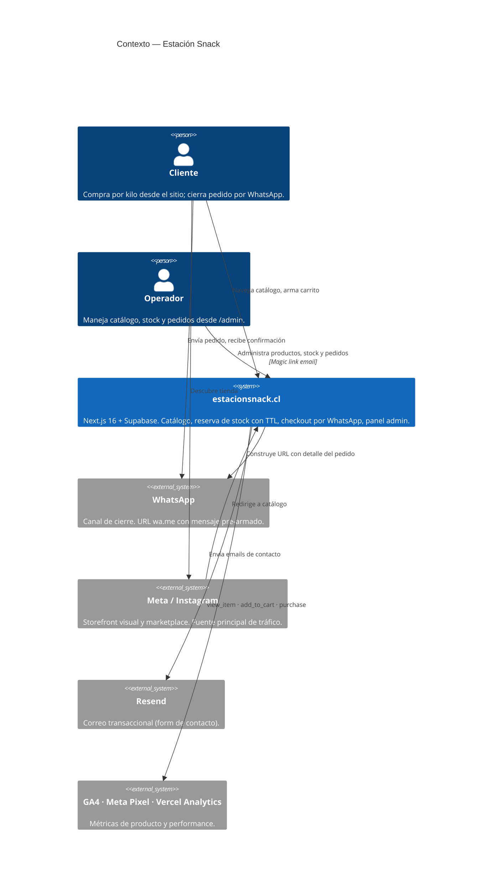

# Estación Snack

[](https://github.com/omarnewton/estacion-snack/actions/workflows/ci.yml)
[](https://estacionsnack.cl)
[](./package.json)
[](./tsconfig.json)

Tienda online por kilo de frutos secos y dulces. Operada por una sola persona desde Santa Cruz, Valle de Colchagua. Pedido se cierra por WhatsApp; pago al recibir o transferencia.

**Producción:** [estacionsnack.cl](https://estacionsnack.cl)

---

## Sobre este proyecto

Proyecto personal. Nace de necesitar una tienda real — catálogo con stock, carrito que no oversell, pedidos que no se pierdan — construida sin equipo técnico ni presupuesto de SaaS comercial.

El repo está armado para que alguien con background técnico pueda entender en ~15 minutos qué hace, por qué está hecho así, y qué cosas no son obvias. Las partes realmente no triviales están documentadas en [`docs/`](./docs) (arquitectura, decisiones, seguridad) en vez de enterradas en el código.

### Cómo se construyó

Lo construí yo (no soy desarrollador de formación) usando Claude como colega técnico asistente. El protocolo de trabajo — plan antes de ejecutar, checkpoints obligatorios antes de operaciones irreversibles, uso de subagentes especializados para revisión de código y research — está codificado en [`CLAUDE.md`](./CLAUDE.md). Prefiero declararlo explícito: las decisiones de arquitectura son mías con asistencia de IA, no de un equipo, y los controles que compensan eso están documentados.

---

## Arquitectura de un vistazo



Diagrama de containers + flujo de pedido en [`docs/ARCHITECTURE.md`](./docs/ARCHITECTURE.md).

---

## Stack

| Capa | Tecnología | Rol |
|---|---|---|
| UI | Next.js 16.2 (App Router) · React 19.2 | Rutas, Server Components, Server Actions |
| Estilos | Tailwind v4 · Framer Motion 12 | Sistema visual + microinteracciones |
| Tipos | TypeScript 5 `strict` | Safety en boundaries públicos |
| Datos | Supabase (PostgreSQL 16) | Productos, pedidos, clientes, reservas, audit log |
| Auth | Supabase Auth (magic link) | Solo admin; clientes usan `access_token` efímero |
| Infra | Vercel | Edge + Static + Cron + Analytics |
| Estado cliente | Zustand 5 + localStorage | Carrito persistente |
| Email | Resend | Contact form |
| Verificación | `tsc --noEmit` + Vitest | Typecheck bloquea merge en CI |

---

## Lo que tiene de no obvio

Cosas que probablemente merece la pena mirar si tu tiempo es poco:

- **Autorización en la base de datos, no en la app.** Todas las tablas de Supabase son `default-deny` vía RLS. Lectura pública solo en `products`. Decisión explicada en [ADR 0002](./docs/ADR/0002-rls-as-primary-authorization-boundary.md).

- **WhatsApp como carril de pago, no como fallback.** Comparado con Mercado Pago / Stripe en costo, fricción, cumplimiento Ley 19.496 y techo de escala. Ver [ADR 0003](./docs/ADR/0003-whatsapp-as-payment-rail.md).

- **`fn_place_order` como transacción PL/pgSQL atómica.** Limpia reservas expiradas → valida stock excluyendo reservas ajenas → descuenta stock → crea order + items + customer → libera reservas de la sesión. Todo con `SELECT FOR UPDATE`. En [`supabase/migrations/0001_init.sql`](./supabase/migrations/0001_init.sql).

- **Access token 256-bit + TTL como sustituto de auth de cliente.** Los pedidos son accesibles vía `/pedido/[id]?t=<token>` sin cuentas, sin passwords. El link es la credencial. Comparación time-safe en [`lib/crypto.ts`](./lib/crypto.ts). Mitiga CWE-639 (IDOR) y CWE-208 (timing side-channel).

- **Audit log append-only + hashing de IPs con pepper.** Trigger de inmutabilidad en Postgres (UPDATE/DELETE bloqueados) + HMAC-SHA256 de IPs y User-Agents para conservar trazabilidad forense sin guardar PII en bruto. Ver `supabase/migrations/0002_rls_hardening.sql`.

- **Security headers OWASP** en [`next.config.ts`](./next.config.ts): HSTS 2 años + preload, `X-Content-Type-Options: nosniff`, `X-Frame-Options: DENY`, `Referrer-Policy` estricto, `Permissions-Policy` bloqueando FLoC, geolocation, camera, mic. CSP nonce-based vía middleware (en progreso).

- **Threat model** en [`docs/THREAT_MODEL.md`](./docs/THREAT_MODEL.md) (STRIDE por componente, 1 página). Audit forense reproducible con `curl` contra el REST API de Supabase en [`SECURITY_AUDIT.md`](./SECURITY_AUDIT.md).

---

## Operaciones

- **Objetivos de servicio** (availability 99.5% mes, LCP p75 mobile < 2.5s): [`docs/SLO.md`](./docs/SLO.md)
- **Runbook**: [`docs/RUNBOOK.md`](./docs/RUNBOOK.md)
- **Hallazgos laterales abiertos**: [`docs/LATERAL_FINDINGS.md`](./docs/LATERAL_FINDINGS.md)
- **Cutover de dominio**: [`docs/CUTOVER.md`](./docs/CUTOVER.md)

---

## Correr en local

```bash
npm install
cp .env.local.example .env.local   # completar con credenciales reales
npm run dev                         # → http://localhost:3000
```

Scripts:

```bash
npm run typecheck    # tsc --noEmit (bloquea merge en CI)
npm run build        # next build
npm start            # server producción local
```

### Variables de entorno

| Variable | Descripción | Requerida |
|---|---|---|
| `NEXT_PUBLIC_SUPABASE_URL` | URL del proyecto Supabase | Sí |
| `NEXT_PUBLIC_SUPABASE_ANON_KEY` | Anon key pública (cliente-visible por diseño) | Sí |
| `SUPABASE_SERVICE_ROLE_KEY` | Service role — **solo servidor**, centralizado en [`lib/supabase/admin.ts`](./lib/supabase/admin.ts) | Sí |
| `ADMIN_EMAIL` | Email único autorizado a `/admin` | Sí |
| `NEXT_PUBLIC_SITE_URL` | URL canónica (`https://estacionsnack.cl`) | Sí en prod |
| `CRON_SECRET` | Bearer token de `/api/cron/release-reservations` | Sí en prod |
| `AUDIT_PEPPER` | Pepper HMAC para hasheo de IPs en audit log | Sí en prod |
| `RESEND_API_KEY` | API key de Resend (contact form) | Opcional |
| `NEXT_PUBLIC_GA4_ID` · `NEXT_PUBLIC_META_PIXEL_ID` | Tracking | Opcional |

El pre-commit hook local escanea patterns de secrets (JWT, AWS, Stripe, etc.) y bloquea commits si aparecen en el diff. Script en [`.claude/hooks/pre-commit-guard.sh`](./.claude/hooks/pre-commit-guard.sh).

---

## Flujo de pedido (resumen)

1. Cliente arma carrito (estado en `localStorage` con session ID).
2. Al confirmar, server action llama a `fn_place_order` (RPC atómico en Postgres).
3. Postgres devuelve `order_id` + `access_token` (256 bits base64url, TTL 30 días).
4. Server action construye URL wa.me con detalle + link al pedido, redirige.
5. WhatsApp se abre con el mensaje pre-armado; cliente lo envía.
6. Operador confirma por WhatsApp → cambia estado en `/admin/pedidos`.
7. Cliente consulta estado en `/pedido/[id]?t=<token>` (`no-store`, `X-Robots-Tag: noindex`).

Cron diario libera reservas TTL 15 min expiradas vía `/api/cron/release-reservations` (gate por `CRON_SECRET` con compare time-safe).

---

## Deploy

Push a `main` = deploy automático a producción en Vercel. Preview deployments automáticos por cada branch y PR.

**Política:** commits directos a `main` prohibidos. Todo cambio pasa por feature branch + PR + `tsc --noEmit` + `next build` verdes. Ver [`.github/workflows/ci.yml`](./.github/workflows/ci.yml).

---

## Migraciones

SQL versionado e idempotente, aplicado manualmente desde el SQL Editor de Supabase en orden:

```
supabase/migrations/
├── 0001_init.sql                          # Schema base + fn_place_order
├── 0002_rls_hardening.sql                 # RLS + audit_log + access_token 256-bit
├── 0003_product_details.sql               # long_description, nutrition, is_active
├── 0004_contact_shipping.sql              # contact_messages + shipping_zones
├── 0005_combos_and_shipping_visible.sql
└── 0006_min_unit_kg.sql
```

Regla dura: **una migración aplicada nunca se edita**. Cambios posteriores en un archivo nuevo con el número siguiente.

---

## Estructura del repo

```
estacion-snack/
├── app/                    # Next.js App Router (pages, API routes, opengraph)
├── components/             # React components (presentación + interacción)
├── lib/                    # Server actions, clients Supabase, crypto, auth guards
├── supabase/migrations/    # SQL versionado (fuente de verdad del schema)
├── data/                   # Seed estático (fallback cuando Supabase no responde)
├── public/img/             # Fotos de productos (JPG + WebP + WebP-400)
├── docs/                   # Arquitectura, ADRs, threat model, SLO, runbook
├── .github/workflows/      # CI
├── .claude/                # Subagentes locales + hooks pre-commit
├── CLAUDE.md               # Protocolo de trabajo (operador + IA)
├── SECURITY_AUDIT.md       # Audit forense RLS (reproducible con curl)
└── vercel.json             # Cron jobs
```

---

## Licencia

Proyecto personal. Código público como referencia; sin permiso de uso comercial.
